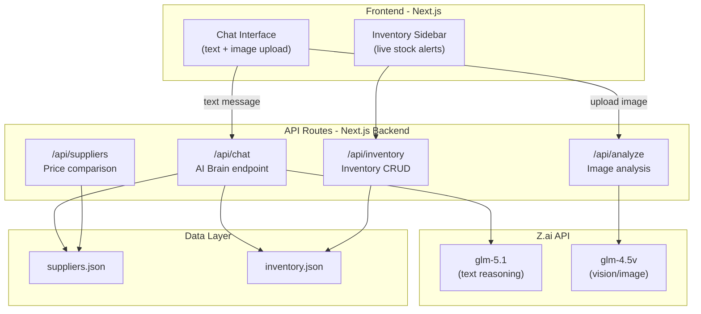
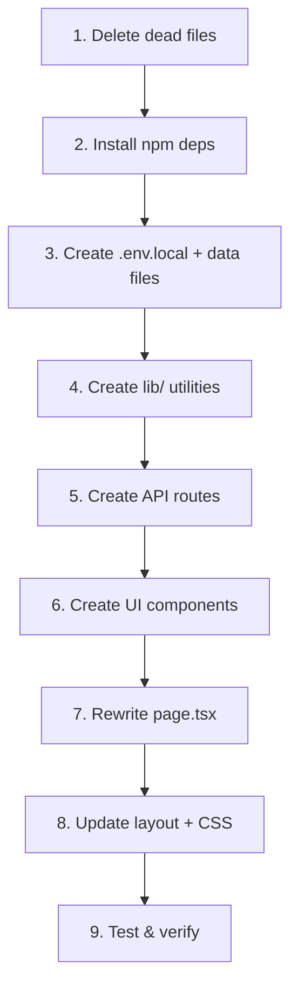

# StockMaster AI: Final Implementation Plan

> Transform the current static mockup into a **fully AI-driven autonomous procurement agent** where every user interaction flows through the AI brain (Z.ai GLM models).

## Decisions Confirmed

| Question | Decision |
|----------|----------|
| AI Provider | **Z.ai** (Zhipu AI) — OpenAI-compatible API |
| Text Model | `glm-5.1` |
| Vision Model | `glm-4.5v` (for fridge photo analysis) |
| Base URL | `https://api.z.ai/api/paas/v4` |
| Voice Input | ❌ Removed — not needed |
| WhatsApp | ✅ Open `wa.me` link with pre-filled order message |
| Data Storage | JSON files (simple, hackathon-friendly) |
| API Key | Stored in `.env.local` (user will paste manually) |

---

## Architecture



### How the AI Brain Works

Every user message goes to `/api/chat`. The AI receives:
1. **System prompt** — tells it to act as a procurement agent for a milk tea shop
2. **Supplier data** — full price list from `suppliers.json` injected into context
3. **Inventory data** — current stock levels from `inventory.json`
4. **Conversation history** — maintains context across messages

The AI then:
- Understands the user's request (even in Malay/English mix like "susu tak ada liao")
- Checks inventory for the relevant items
- Compares suppliers for best prices
- Responds with structured recommendations
- Can draft WhatsApp order messages

For image uploads (`/api/analyze`):
- Fridge/storage photo → sent to `glm-4.5v` vision model
- AI identifies what's missing/low → returns structured analysis
- Results feed back into the chat conversation

---

## File Changes

### 🗑️ DELETE (4 files)

| File | Reason |
|------|--------|
| `code.py` | Empty, unused |
| `requirements.txt` | Python deps not needed |
| `tailwind.config.ts` (root) | Orphan at wrong level |
| `inverntory.xlsx` | Misspelled, empty, replaced by JSON |

---

### ✏️ MODIFY (6 files)

#### [MODIFY] [page.tsx](file:///c:/Users/Nitro/hackathon/umhackathon2026-galaxyannihilator11111/stockmaster-ui/app/page.tsx)
**Full rewrite.** Currently 311 lines of static HTML → becomes a real AI chat app:
- Message state management (user messages + AI responses)
- Send text messages to `/api/chat` and stream responses
- Image upload (drag-drop + click) → sends to `/api/analyze`
- Renders AI responses with structured cards (stock alerts, supplier comparisons, order drafts)
- Sidebar pulls live inventory from `/api/inventory`
- Loading/typing indicators, error handling
- WhatsApp order button opens `wa.me` link with pre-filled text

#### [MODIFY] [layout.tsx](file:///c:/Users/Nitro/hackathon/umhackathon2026-galaxyannihilator11111/stockmaster-ui/app/layout.tsx)
- Fix metadata: title → "StockMaster AI", proper description
- Add dark mode class to `<html>`
- Import premium Google Font (Inter)

#### [MODIFY] [globals.css](file:///c:/Users/Nitro/hackathon/umhackathon2026-galaxyannihilator11111/stockmaster-ui/app/globals.css)
- Add typing indicator animation
- Add message slide-in animation
- Add shimmer loading effect
- Add image upload dropzone styles
- Enhance dark theme colors for premium feel

#### [MODIFY] [package.json](file:///c:/Users/Nitro/hackathon/umhackathon2026-galaxyannihilator11111/stockmaster-ui/package.json)
- Add `openai` (npm package — works with Z.ai since it's OpenAI-compatible)
- Add `react-markdown` (render AI responses with formatting)
- Add `react-dropzone` (image upload)
- Add `framer-motion` (animations)

#### [MODIFY] [README.md](file:///c:/Users/Nitro/hackathon/umhackathon2026-galaxyannihilator11111/README.md)
- Add proper project description, setup steps, architecture diagram

#### [MODIFY] [next.config.ts](file:///c:/Users/Nitro/hackathon/umhackathon2026-galaxyannihilator11111/stockmaster-ui/next.config.ts)
- Add `serverExternalPackages` for openai if needed

---

### 🆕 CREATE (14 files)

#### Environment

##### [NEW] `stockmaster-ui/.env.local`
```
ZAI_API_KEY=paste-your-key-here
ZAI_BASE_URL=https://api.z.ai/api/paas/v4
ZAI_MODEL=glm-5.1
ZAI_VISION_MODEL=glm-4.5v
```
> User will manually replace `paste-your-key-here` with their actual key.

---

#### API Routes (The AI Brain)

##### [NEW] `app/api/chat/route.ts`
Core endpoint — every text message goes here.
- Receives: `{ message, conversationHistory, inventory, suppliers }`
- Builds system prompt with supplier data + inventory context
- Calls Z.ai `glm-5.1` via OpenAI-compatible SDK
- Streams response back to frontend
- AI can return structured JSON for special cards (supplier comparison, order drafts)

##### [NEW] `app/api/analyze/route.ts`
Image analysis endpoint.
- Receives: FormData with image file
- Converts image to base64
- Sends to Z.ai `glm-4.5v` with prompt: "Analyze this fridge/storage photo for a milk tea shop. Identify items that are low or missing."
- Returns structured analysis + AI commentary

##### [NEW] `app/api/inventory/route.ts`
Inventory CRUD.
- `GET` → returns current inventory with stock levels
- `POST` → update stock levels (e.g., after restocking)
- Reads/writes `data/inventory.json`

##### [NEW] `app/api/suppliers/route.ts`
Supplier data endpoint.
- `GET` → returns all suppliers
- `GET ?item=milk` → returns price comparison for specific item
- Reads from `data/suppliers.json`

---

#### Data Files

##### [NEW] `stockmaster-ui/data/suppliers.json`
Restructured from the existing `Milk Tea Supplier List.json`:
```json
{
  "suppliers": [
    {
      "name": "Dairy Farms Inc.",
      "items": [
        { "name": "Fresh Whole Milk", "unit": "Case (4 x 1 Gallon)", "priceRM": 73.12 }
      ]
    }
  ]
}
```

##### [NEW] `stockmaster-ui/data/inventory.json`
Initial inventory for the milk tea shop with realistic stock levels:
```json
{
  "items": [
    { "id": "1", "name": "Fresh Whole Milk", "category": "Dairy", "currentStock": 0, "minStock": 5, "unit": "Case" },
    { "id": "2", "name": "Tapioca Pearls", "category": "Boba", "currentStock": 1, "minStock": 3, "unit": "3kg bag" }
  ]
}
```

---

#### Frontend Components

##### [NEW] `components/chat/ChatMessage.tsx`
Renders a single chat message (user or AI). Handles:
- Plain text with markdown rendering
- Structured cards (embeds StockAlertCard, SupplierCard, OrderCard)
- Image previews when user uploaded a photo

##### [NEW] `components/chat/StockAlertCard.tsx`
Card showing detected stock gaps with severity badges (critical/low/ok)

##### [NEW] `components/chat/SupplierComparisonCard.tsx`
Price comparison table across suppliers, highlighting best deal

##### [NEW] `components/chat/OrderDraftCard.tsx`
Order draft card with WhatsApp send button (`wa.me` link)

##### [NEW] `components/chat/ImageUpload.tsx`
Drag-and-drop image upload zone, integrated into chat input area

##### [NEW] `components/chat/TypingIndicator.tsx`
Animated dots showing AI is "thinking"

---

#### Utilities

##### [NEW] `lib/utils.ts`
`cn()` helper for Tailwind class merging (currently missing but imported by button.tsx)

##### [NEW] `lib/ai.ts`
Z.ai client configuration — creates OpenAI client pointed at Z.ai base URL

---

## Execution Order



## Summary

| Action | Count |
|--------|-------|
| 🗑️ DELETE | 4 files |
| ✏️ MODIFY | 6 files |
| 🆕 CREATE | 14 files |
| ✅ KEEP AS-IS | 8 files (`button.tsx`, configs, etc.) |
| **Total touches** | **24 files** |

---

## Verification Plan

### Build Check
- `npm run build` — must pass with zero errors

### API Tests (browser/curl)
1. `POST /api/chat` → send "milk habis" → AI responds with supplier comparison
2. `POST /api/analyze` → upload fridge photo → AI identifies missing items
3. `GET /api/inventory` → returns stock levels
4. `GET /api/suppliers?item=milk` → returns price comparison

### End-to-End Browser Test
1. Open app → AI greeting appears
2. Type "Boss, susu tak ada liao!" → AI identifies milk shortage, shows supplier prices, drafts WhatsApp order
3. Upload a fridge photo → AI analyzes and identifies stock gaps
4. Click "Send via WhatsApp" → opens wa.me with pre-filled order
5. Sidebar shows live low-stock alerts
